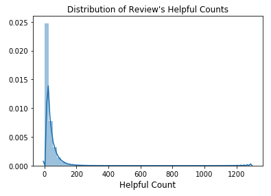
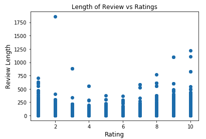
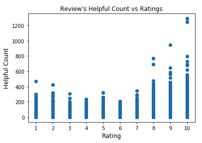
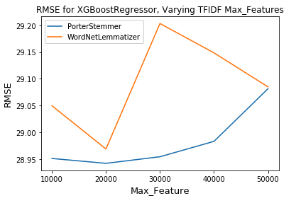
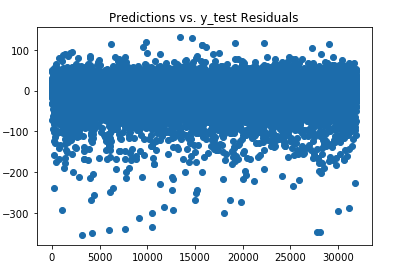
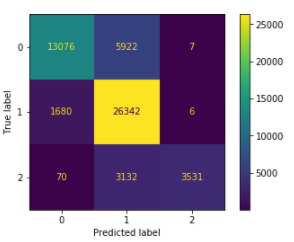

# Is This Review Helpful?
Predicting the helpfulness of online drug reviews. 

### Motivation and Goals

Online shopping is increasingly becoming people's perferred method of shopping. Especially during COVID-19, in which people are avoiding stepping out of their homes by purchasing things through online marketplaces. On every online marketplace, no matter the type of product, there will always be product reviews and customers would rely on these reviews to choose which product to purchase. As product reviews are constantly being left by previous customers, the large amount of reviews makes it difficult for customers to go through all the reviews to make purchase decisions. 

In this project, my goal is to develop a model that can predict the helpfulness of the reviews. So that when a review is posted online, the model will predict its helpfulness which will give the new review a chance to be read by customers. An online market can implement this model to improve their product review section by optimizing how the reviews will be sorted. 

I will be building two models:
1. Regression model >> predict the exact number of poeple who find the review helpful 
2. Classification model >> categorize the reviews in to 3 categories:
    - slightly helpful (<10 people find it helpful)
    - helpful (10 - 59 people find it helpful)
    - very helpful (60 or more people find it helpful)

### Data

Data obtained from the UCI Machine Learning Repository (https://archive.ics.uci.edu/ml/datasets/Drug+Review+Dataset+%28Drugs.com%29). A small sample of the data can be found in the 'data' folder of this repo. 

It provides a total of 21,5063 drug reviews, which are separated into train (75%) and test (25%). 
Train data consits of 16,1297 reviews, while the test data consists of 53,766 reviews. 

Other than the actual review, dataset also has information such as the drug name, condition that the drug is for, rating of the review, date of the review, and the useful count of the review. 

### EDA

We are interested in predicting the helpful count of each review. So let's look at the distribution of review's helpful counts. 

The distribution of helpful counts is right skewed, which does make sense because most reviews would not receive a high number of upvotes for being helpful. 

The length of review is usually longer for reviews with ratings at the lower and higher end. Reviewers tend to write less when they give a netural rating. 

For reviews with higher ratings, the helpful count of the review also tends to be higher. 

 
### Predictive Modeling - Regression

##### NLP 
- removed English stopwords, digits, puncutation
- all text changed to lowercase
- tried stemming and lemmatization >> testing result suggest to go with Stemming + 20,000 max features 

##### Feature Engineering 
- review_len = length of initial review
- count_unique_word = number of unique word after review has been cleaned
- compund = sentiment score using VADER, using only compound score

##### Results
Model | RMSE (on validation set)
------------ | -------------
LinearRegression| 31.74
DecisionTreeRegressor| 31.78
GradientBoostingRegressor | 31.50
XGBoostRegressor | 28.95

Residual plot using predictions from XGBoostRegressor model

Final model is XGBoostRegressor with parameters:
- learning_rate=0.3
- max_depth=7
- min_child_weight=3
- subsample=1

RMSE (on test set) = 29.22

### Predictive Modeling - Classification

Same text processing and feature engineering as regression. 
Except that the reviews are divided into 3 categories based on their helpful counts:
    - slightly helpful (<10 helpful counts)
    - helpful (10 - 59 helpful counts)
    - very helpful (60 or more helpful counts)
    
Approach 1: Using only cleaned text to predict the helpful category. Undersample.
    
    - highest accuracy was 52% using RandomForestClassifier

Approach 2: Using only cleaned text to predict the helpful category. Oversample.
    
    - highest accuracy was 79% also using RandomForestClassifier

Approach 3: Include all features. Leave categories imbalanced.
    

    - highest accuracy was 80%, using RandomForestClassifier with default parameters.

Sometimes predicting the exact number of helpful counts may not be required. By knowing just the category of the review it belongs to, a business can still evaluate this prediction and help to prioritize the predicted 'helpful' reviews in an appropriate order so that they will not get lost in the long list of reviews and be viewed by customers.  

### Next Steps
- build a flask app that allow user to input a review and receive a predicted helpful count 
- try out multiclass classification with LSTM
